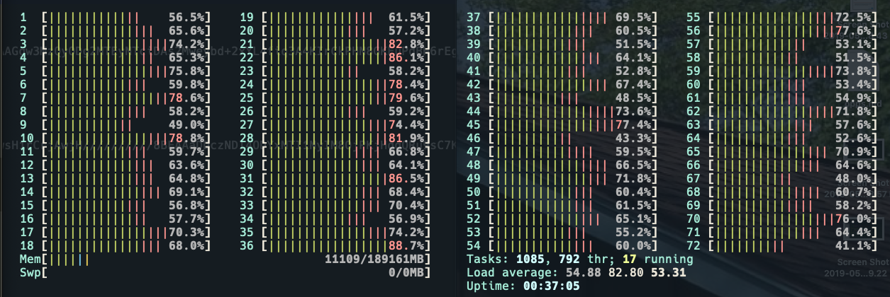

# S3 Massive Sync

How can I sync massive amounts of S3 data from a bucket in one region
to another really fast?

I searched around and found solutions based on Lambda, AWS Batch, etc.
The following method is by far simpler.

First, spin up an AWS EC2 `c5n.18xlarge` or something comparable. It
will cost you $4.00/hr.

## Files Arranged in Folders

If your files are arranged in "folders" it's pretty easy. You can use
`aws s3 sync` and run hundreds or thousands of syncs in parallel.

One set of our data was arranged like this.

```sh
somebucket/2019/04/30/10/file.a
somebucket/2019/04/30/10/file.b
somebucket/2019/04/30/10/file.c
somebucket/2019/04/30/11/file.a
somebucket/2019/04/30/11/file.b
somebucket/2019/04/30/11/file.c
```

So the `parallel-sync.sh` script below worked really well. The killer
feature is https://www.gnu.org/software/parallel

We start today and go back 90 days by hour. We run a maximum of 1,000
parallel instances of `aws s3 sync` and keep going till all the hours
are done.

```sh
#!/bin/bash
# parallel-sync.sh

start=$(date +%s)
end=$(date +%s -d'now - 90 days')

# loop gives you this.
# 2019/04/30/10
# 2019/04/30/09
# 2019/04/30/08

while true; do
    date +%Y/%m/%d/%H -d@$start
    start=$((start -(60*60)))
    [[ $start -lt $end ]] && break
done \
| tee prefixes.txt \
| ./parallel --ungroup -j 1000 aws s3 sync \
  s3://somebucket/{} \
  s3://anotherbucket/{}
```

If an hour's worth of data takes 5 minutes and you have to sync a
whole month it will take about 5 minutes.

One snag we ran into was file descriptor limits. This fixed it.
https://underyx.me/articles/raising-the-maximum-number-of-file-descriptors

```sh
tail -n6 /etc/security/limits.conf
*    soft nofile 64000
*    hard nofile 64000
root soft nofile 64000
root hard nofile 64000
# End of file
```

## Files NOT Arranged in Folders

If your data isn't organized into folders you are in trouble.

We had some data organized like this.

```sh
bucket-a/2019-05-08T06:37:28.020Z
bucket-a/2019-05-08T06:37:28.050Z
bucket-a/2019-05-08T06:37:28.060Z
bucket-a/2019-05-08T06:37:28.110Z
bucket-a/2019-05-08T06:37:28.160Z
bucket-a/2019-05-08T06:37:28.200Z
bucket-a/2019-05-08T06:37:28.370Z
bucket-a/2019-05-08T06:37:28.400Z
bucket-a/2019-05-08T06:37:28.420Z
```

The sync command below "worked" but it took 15 minutes just to figure
out the files it was going to sync. Then add on top of that the time
it took to sync the hour's worth of data -- 20 minutes per hour instead
of 5.

```sh
aws s3 sync --dryrun --exclude "*" --include "2019-05-08T06*" s3://bucket-a/ s3://bucket-b/
```

We aren't sure if the sync will be faster or just listing all the keys
and doing a parallel copy.

Here's the parallel copy script.

```sh
#!/bin/bash

start=$(date +%s)
end=$(date +%s -d'now - 1 days')

# loop gives you this.
# 2019-05-08T18:00:02.023Z
# 2019-05-08T18:00:02.150Z
# 2019-05-08T18:00:03.167Z

while true; do
    P="$(date +%Y-%m-%dT%H -d@$start)"
    aws s3api list-objects-v2 --bucket some-bucket \
      --prefix "$P" | jq -r '.[][] | .Key'
    start=$((start -(60*60)))
    [[ $start -lt $end ]] && break
done \
| tee hexmny274.raw \
| ./parallel --ungroup -j 4 aws s3 cp \
  s3://some-bucket/{} \
  s3://other-bucket/{}
```

NOTE: All of this is thanks to a guy named Paul who whipped it up in
a few minutes. You would like to hire Paul. So would I.


